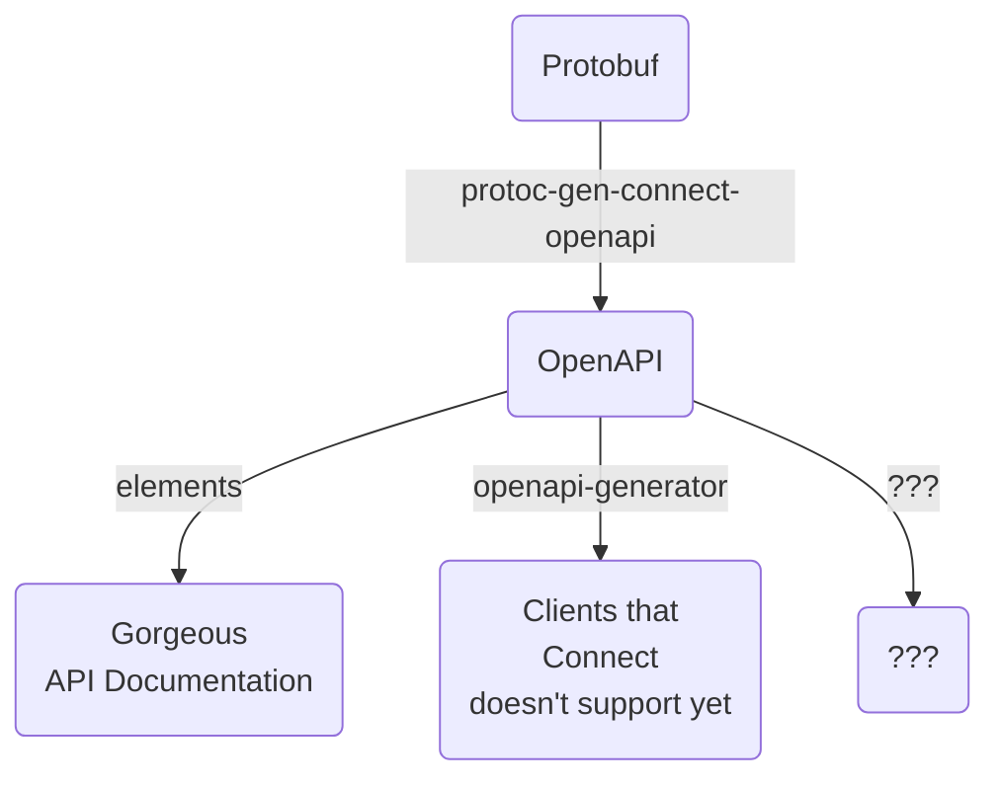

# protoc-gen-connect-openapi
Generate OpenAPIv3 from protobufs matching the Connect interface

Options:
 - format=yaml (default)
 - format=json
 - base=[path]
 

```mermaid
flowchart TD

protobuf(Protobuf) -->|protoc-gen-connect-openapi| openapi(OpenAPI)
openapi -->|elements| prettydocs(Gorgeous\nAPI Documentation)
openapi -->|openapi-generator| other-languages(Clients that\nConnect\ndoesn't support yet)
openapi -->|???| ???(???)
click elements "https://github.com/stoplightio/elements" _blank
click openapi-generator "https://github.com/OpenAPITools/openapi-generator" _blank
```
