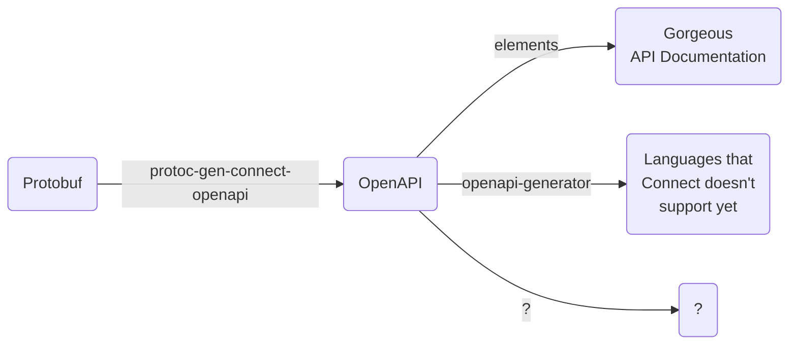

# protoc-gen-connect-openapi
Generate OpenAPI v3.1 from protobuf matching the [Connect protocol](https://connectrpc.com/docs/protocol).

With this OpenAPI file, you can:

- Generate Documentation (Elements, redoc, etc.)
- Generate HTTP Clients for places where you cannot use gRPC (openapi-generator)



## Install
```
go install github.com/sudorandom/protoc-gen-connect-openapi@main
```

## Usage
### With protoc
This tool works as a plugin for protoc. Here's a basic example:
```shell
protoc internal/converter/fixtures/helloworld.proto --connect-openapi_out=gen
```

With the JSON format:
```shell
protoc internal/converter/fixtures/helloworld.proto \
    --connect-openapi_out=gen \
--connect-openapi_opt=format=json
```

With a base OpenAPI file and without all of the streaming content type:
```shell
protoc internal/converter/fixtures/helloworld.proto \
    --connect-openapi_out=gen \
    --connect-openapi_opt=base=example.base.yaml,without-streaming
```

See `protoc --help` for more protoc options.

### Using buf
With buf you can make a `buf.gen.yaml` with your options, like this:
```
version: v1
plugins:
  - plugin: connect-openapi
    out: out
    opt:
    - base=example.base.yaml
```
And then run `buf generate`. See [the documentation on buf generate](https://buf.build/docs/reference/cli/buf/generate#usage) for more help.

## Options
| Option | Values | Description |
|---|---|---|
| path | `{filepath}` | Output filepath, defaults to per-protofile output if not given. |
| format | `yaml` or `json` | Which format to use for the OpenAPI file, defaults to `yaml`. |
| base | `{filepath}` | The path to a base OpenAPI file to populate fienlds that this tool doesn't populate. |
| with-streaming | - | Generate OpenAPI with content types related to streaming (can be messy). |
| only-string-enum-values | - | Only use strings for enum values, defaults to showing integers and strings |
| debug | - | Emit debug logs |


## Why?
[Connect](https://connectrpc.com/docs/introduction) makes your gRPC service look and feel like a normal HTTP/JSON API, at least for non-streaming RPC calls. It does this without an extra network hop and an extra proxy layer because the same Connect server can speak [the Connect, gRPC and gRPC-Web protocols in a single port](https://connectrpc.com/docs/multi-protocol).

This is what a GET request looks like. Note that GET requests are available for methods with an option of `idempotency_level=NO_SIDE_EFFECTS`.
```
> GET /connectrpc.greet.v1.GreetService/Greet?encoding=json&message=%7B%22name%22%3A%22Buf%22%7D HTTP/1.1
> Host: demo.connectrpc.com

< HTTP/1.1 200 OK
< Content-Type: application/json
<
< {"greeting": "Hello, Buf!"}
```
We can document this API as if it's a real JSON/HTTP API... because it is, and the gRPC "flavor" isn't so noticable due to Connect. With protoc-gen-connect-openapi you can declare your API using protobuf, serve it using gRPC and Connect and fully document it without the API consumers ever knowing what protobuf is or how to read it.
