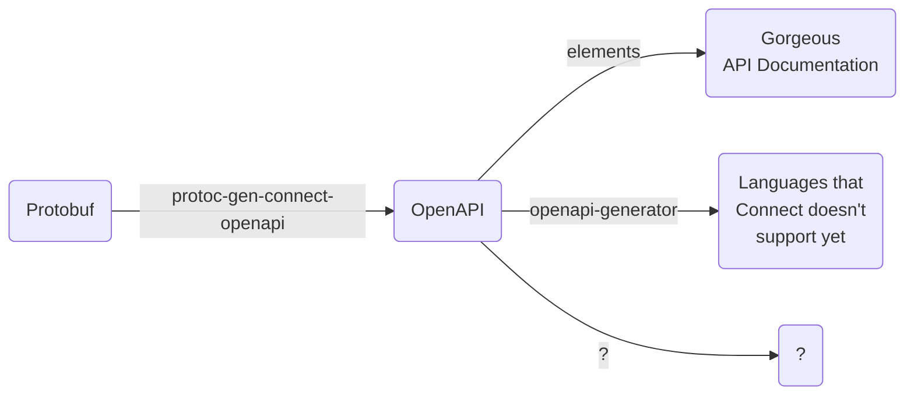

# protoc-gen-connect-openapi
Generate OpenAPIv3 from protobufs matching the API that [Connect RPC](https://connectrpc.com/docs/protocol) exposes.

Options:
 - format=yaml (default)
 - format=json
 - base=[path]

## Install

```
go install github.com/sudorandom/protoc-gen-connect-openapi@latest
```

## Build using `buf generate`
Simple example, should result in a OpenAPI file in the `out/` directory.
```yaml
version: v1
plugins:
  - plugin: connect-openapi
    out: out
```




TODO:
- Add support for GET request query params (instead of via the body, which essentially makes it a POST)
  - Perhaps we make this a configuratable option?
- Add details for "extra" query params and headers that connect has
  - Query param
    - encoding=json
    - message
    - base64
    - compression
    - connect
