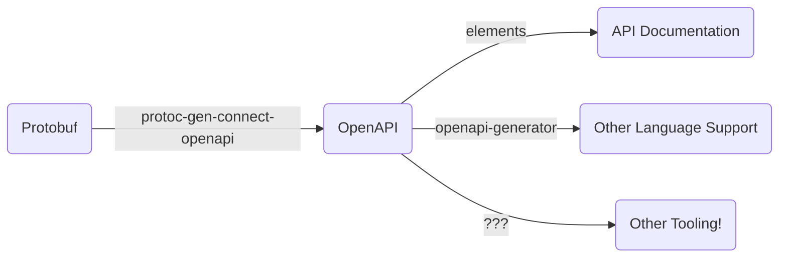

# protoc-gen-connect-openapi
[](https://github.com/sudorandom/protoc-gen-connect-openapi/actions/workflows/go.yml) [](https://goreportcard.com/report/github.com/sudorandom/protoc-gen-connect-openapi) [](https://pkg.go.dev/github.com/sudorandom/protoc-gen-connect-openapi)

Generate OpenAPI v3.1 from protobuf matching the [Connect protocol](https://connectrpc.com/docs/protocol). With these [OpenAPI](https://www.openapis.org/what-is-openapi) specs, you can:

- Generate Documentation (Elements, redoc, etc.)
- Generate HTTP Clients for places where you cannot use gRPC (openapi-generator)
- Datasource for automated endpoint validation/security testing
- Datasource for monitoring dashboards
- Many other things

Features:
- Support for OpenAPIv3.1 (which has support for jsonschema)
- Support for many [Protovalidate](https://github.com/bufbuild/protovalidate) options ([more info](protovalidate.md))
- Support for many [OpenAPIv3](https://github.com/google/gnostic/blob/main/openapiv3/annotations.proto) options from the [google/gnostic project](https://github.com/google/gnostic) protobufs ([more info](gnostic.md))
- Support for [gRPC-Gateway annotations](https://github.com/grpc-ecosystem/grpc-gateway) ([more info](grpcgateway.md))
- Has [an easy interface](https://pkg.go.dev/github.com/sudorandom/protoc-gen-connect-openapi/converter) for generating OpenAPI specs in-process for Go

Example Pipeline:
- Protobuf file: [example](examples/basic.proto)
- OpenAPI file: [example](examples/basic.openapi.yaml)
- Generate documentation: [redocly example](examples/basic.png)



## Why?
[Connect](https://connectrpc.com/docs/introduction) makes your gRPC service look and feel like a normal HTTP/JSON API, at least for non-streaming RPC calls. It does this without an extra network hop and an extra proxy layer because the same Connect server can speak [the Connect, gRPC and gRPC-Web protocols in a single port](https://connectrpc.com/docs/multi-protocol).

This is what a GET request looks like. Note that GET requests are available for methods with an option of `idempotency_level=NO_SIDE_EFFECTS`.
```
> GET /connectrpc.greet.v1.GreetService/Greet?encoding=json&message=%7B%22name%22%3A%22Buf%22%7D HTTP/1.1
> Host: demo.connectrpc.com

< HTTP/1.1 200 OK
< Content-Type: application/json
<
< {"greeting": "Hello, Buf!"}
```
We can document this API as if it's a real JSON/HTTP API... because it is, and the gRPC "flavor" isn't so noticable due to Connect. With protoc-gen-connect-openapi you can declare your API using protobuf, serve it using gRPC and Connect and fully document it without the API consumers ever knowing what protobuf is or how to read it.

## Install

### Binaries
You can download pre-built binaries from the [Github releases page](https://github.com/sudorandom/protoc-gen-connect-openapi/releases/latest).

### asdf

```shell
$ asdf plugin add protoc-gen-connect-openapi https://github.com/sudorandom/asdf-protoc-gen-connect-openapi.git
$ asdf list all protoc-gen-connect-openapi
$ asdf install protoc-gen-connect-openapi latest
$ asdf global protoc-gen-connect-openapi latest
```

### Using Go

It isn't recommended, but you can also install directly using Go:
```shell
go install github.com/sudorandom/protoc-gen-connect-openapi@latest
protoc-gen-connect-openapi --version
```

Or you can actually use `go run` directly from `buf.gen.yaml`, if that's the protobuf generation tool that you're using:

```yaml
version: v2
plugins:
  - local: ["go", "run", "github.com/sudorandom/protoc-gen-connect-openapi@latest"]
    out: gen
```

### Using "go tool" support

If you are already using Go, it may make sense to also use the new "go tool" support added in Go 1.24:
```
go get -tool github.com/sudorandom/protoc-gen-connect-openapi@latest
go tool protoc-gen-connect-openapi --version
```

Again, you can run the plugin in this mode with `buf generate` using this `buf.gen.yaml` file:

```yaml
version: v2
plugins:
  - local: ["go", "tool", "protoc-gen-connect-openapi"]
    out: gen
```

## Usage

### Using buf
This plugin is now available [as a remote plugin in the BSR](https://buf.build/community/sudorandom-connect-openapi).

```
version: v2
plugins:
  - remote: buf.build/community/sudorandom-connect-openapi:v0.19.1
    out: gen
    opt:
    - base=example.base.yaml
```

If you use this config you don't actually need to do the install steps above. See the buf page on [remote plugins](https://buf.build/docs/bsr/remote-plugins/usage/) for more information on this.

Of course, you can also use it locally, with a `buf.gen.yaml` that looks like this:
```yaml
version: v2
plugins:
  - local: protoc-gen-connect-openapi
    out: gen
    opt:
    - base=example.base.yaml
```
And then run `buf generate`. See [the documentation on buf generate](https://buf.build/docs/reference/cli/buf/generate#usage) for more help.

### With protoc
This tool works as a plugin for protoc. Here's a basic example:
```shell
protoc internal/converter/fixtures/helloworld.proto --connect-openapi_out=gen
```

With the JSON format:
```shell
protoc internal/converter/fixtures/helloworld.proto \
    --connect-openapi_out=gen \
--connect-openapi_opt=format=json
```

With a base OpenAPI file and without all of the streaming content type:
```shell
protoc internal/converter/fixtures/helloworld.proto \
    --connect-openapi_out=gen \
    --connect-openapi_opt=base=example.base.yaml,content-types=json
```

See `protoc --help` for more protoc options.

### Protovalidate Support
protoc-gen-connect-openapi also has support for many [Protovalidate](https://github.com/bufbuild/protovalidate) annotations. Note that not every Protovalidate constraint translates clearly to OpenAPI.

[See the Protovalidate documentation page for more information](protovalidate.md)

### gRPC-Gateway annotations
protoc-gen-connect-openapi also has support for the [gRPC-Gateway annotations](https://grpc-ecosystem.github.io/grpc-gateway/docs/tutorials/adding_annotations/) provided by the [google/api/annotations.proto](https://github.com/googleapis/googleapis/blob/master/google/api/annotations.proto).

[See the gRPC-Gateway annotation documentation page for more information](grpcgateway.md)

### Gnostic Support
protoc-gen-connect-openapi also has support for the [OpenAPI v3 annotations](https://github.com/google/gnostic/blob/main/openapiv3/annotations.proto) provided by the [google/gnostic project](https://github.com/google/gnostic).

[See the gnostic documentation page for more information](gnostic.md)

## Options
| Option                     | Values | Description                                                                                                                                                   |
|----------------------------|---|--------------------------------------------------------------------------------------------------------------------------------------------------------------------|
| allow-get                  | - | For methods that have `IdempotencyLevel=IDEMPOTENT`, this option will generate HTTP `GET` requests instead of `POST`.                                              |
| base                       | `{filepath}` | The path to a base OpenAPI file to populate fields that this tool doesn't populate. This option does not work when used with the remote plugin.         |
| override                   | `{filepath}` | The path to an override OpenAPI file to override schema componenets generated by the plugin. This option does not work when used with the remote plugin.|
| content-types              | `json;proto` | Semicolon-separated content types to generate requests/repsonses                                                                                        |
| debug                      | - | Emit debug logs                                                                                                                                                    |
| format                     | `yaml` or `json` | Which format to use for the OpenAPI file, defaults to `yaml`.                                                                                       |
| ignore-googleapi-http      | - | Ignore `google.api.http` options on methods when generating openapi specs                                                                                          |
| include-number-enum-values | - | Include number enum values beside the string versions, defaults to only showing strings                                                                            |
| path                       | `{filepath}` | Output filepath, defaults to per-proto file output if not given.                                                                                         |
| path-prefix                | - | Prefixes the given string to the beginning of each HTTP path.                                                                                                      |
| proto                      | - | Generate requests/responses with the protobuf content type                                                                                                         |
| services                   | - | Specifies which services to include in the generated OpenAPI specification. If omitted, all services are included. The service name must be fully qualified (e.g., "package.name.ServiceName"). Wildcards (`*` and `**`) are supported; `*` matches a single package segment, while `**` matches multiple. This option can be provided multiple times to include multiple services. |
| trim-unused-types          | - | Remove types that aren't references from any method request or response.                                                                                           |
| short-service-tags         | - | Use the short service name instead of the full name for OpenAPI tags.                                                                                              |
| without-default-tags       | - | Avoid appending default tags in the resulting OAS doc. All tags need to be explicitly defined through annotations.                                                 |
| short-operation-ids        | - | Set the operationId to shortServiceName + "_" + method short name instead of the full method name.                                                                 |
| with-proto-annotations     | - | Add protobuf type annotations to the end of descriptions so users know the protobuf type that the field converts to.                                               |
| with-proto-names           | - | Use protobuf field names instead of the camelCase JSON names for property names.                                                                                   |
| with-streaming             | - | Generate OpenAPI for client/server/bidirectional streaming RPCs (can be messy).                                                                                    |

### Contributing
Contributions are accepted and welcome! Please make sure that all tests pass locally for you. You normally can use normal Go tooling to run tests but if you change any protobuf files in `internal/converter/testdata/`, you need to run this command to ensure the related DescriptorSet gets updated:
```
go generate ./internal/converter/testdata
```
This exists because it's the easiest way to pull in buf dependencies in a reliable way.

Otherwise, tests are run with:
```shell
go test ./...

# or, if you prefer:
just test
```
