# protoc-gen-connect-openapi
Generate OpenAPIv3 from protobufs matching the Connect interface

Options:
 - format=yaml (default)
 - format=json
 - base=[path]

```mermaid
flowchart TD

protobuf(Protobuf) -->|protoc-gen-connect-openapi| openapi(OpenAPI)
openapi -->|elements| elements(😍 Gorgeous\nAPI Documentation)
openapi -->|openapi-generator| other-languages(🧑‍💻 Languages that\nConnect doesn't\n support yet)
openapi -->|❔| ???(❓)
click elements "https://github.com/stoplightio/elements" _blank
click openapi-generator "https://github.com/OpenAPITools/openapi-generator" _blank
```
 

TODO:
- Add support for GET request query params (instead of via the body, which essentially makes it a POST)
  - Perhaps we make this a configuratable option?
- Add details for "extra" query params and headers that connect has
  - Query param
    - encoding=json
    - message
    - base64
    - compression
    - connect
